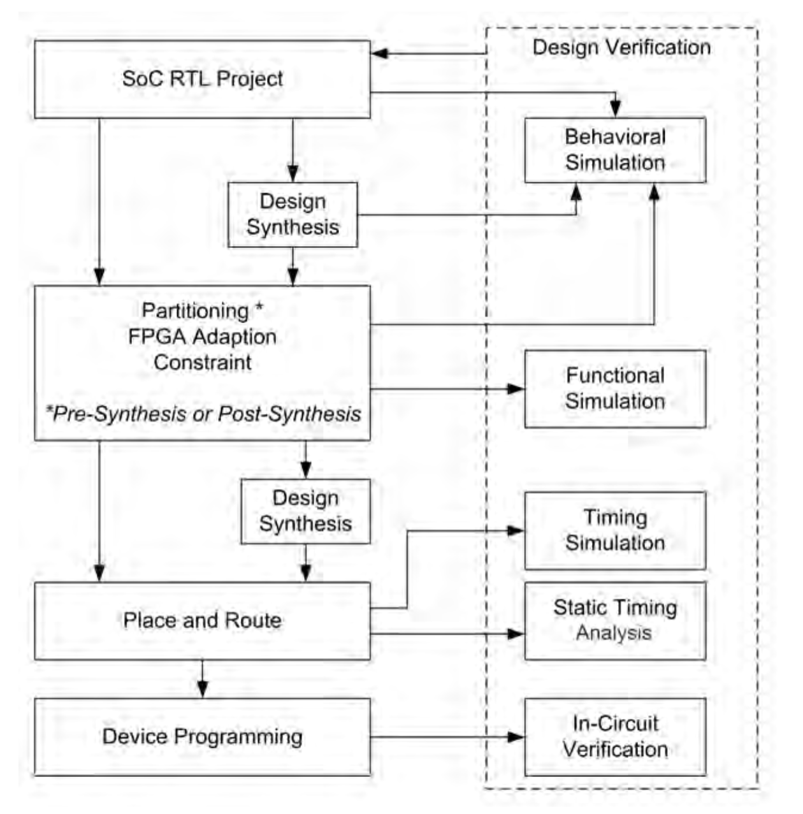
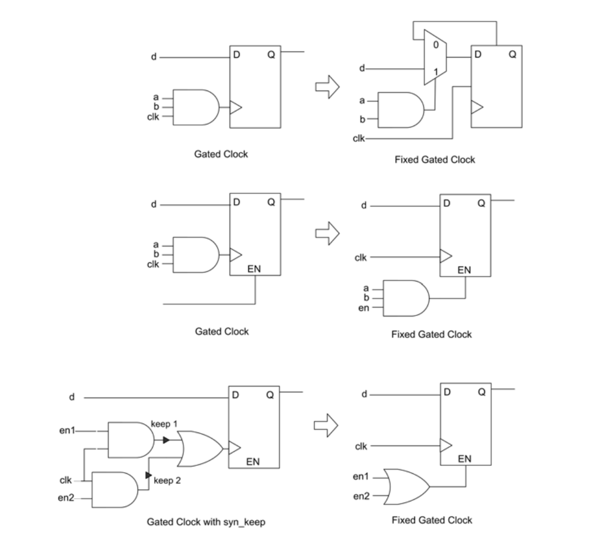
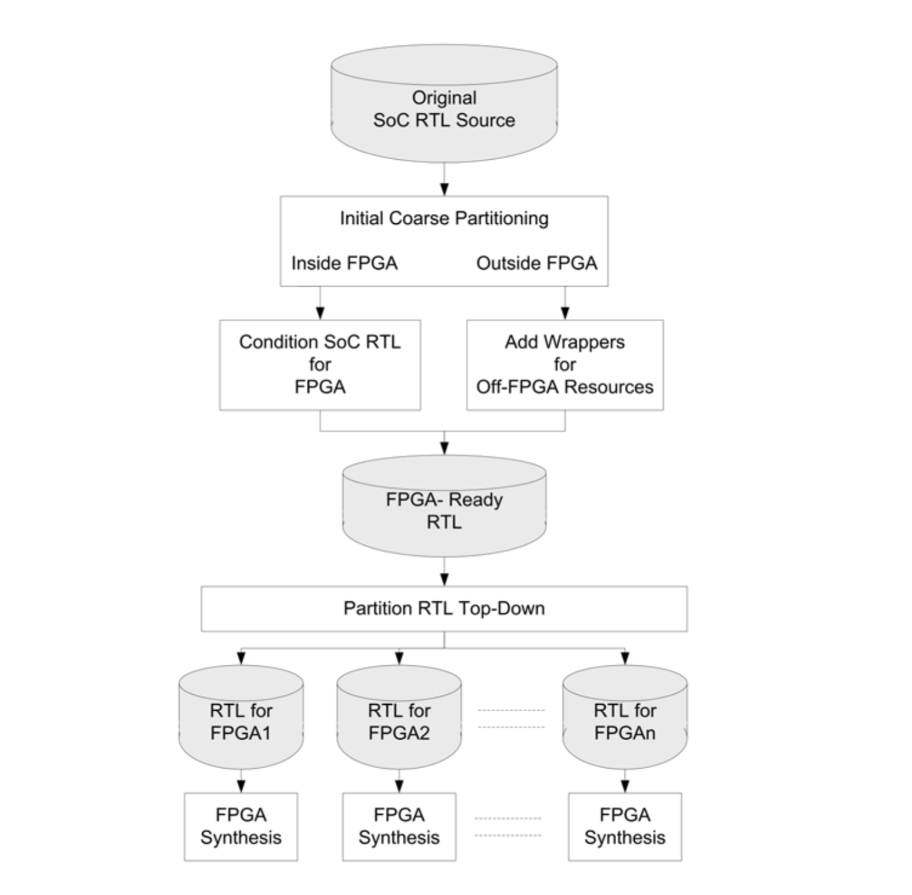
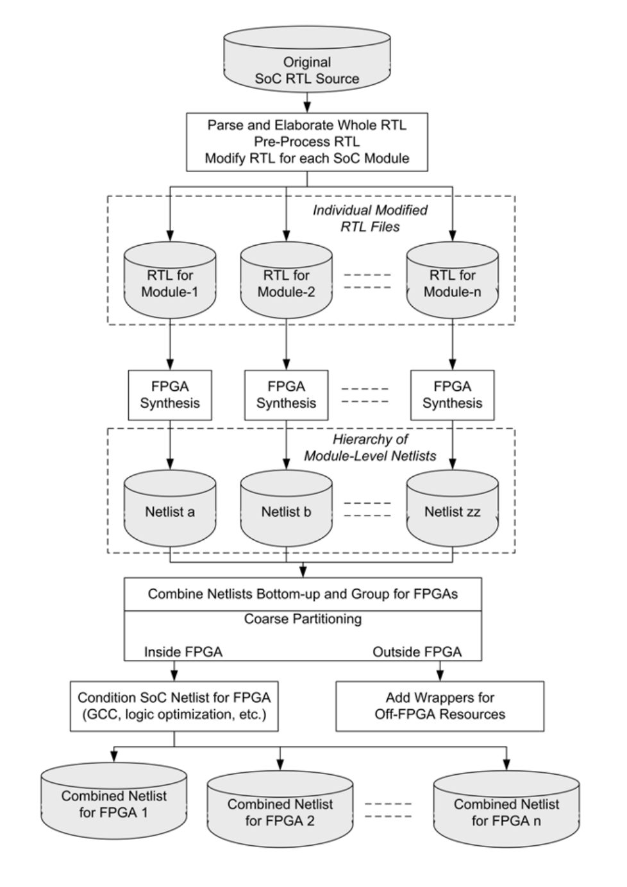
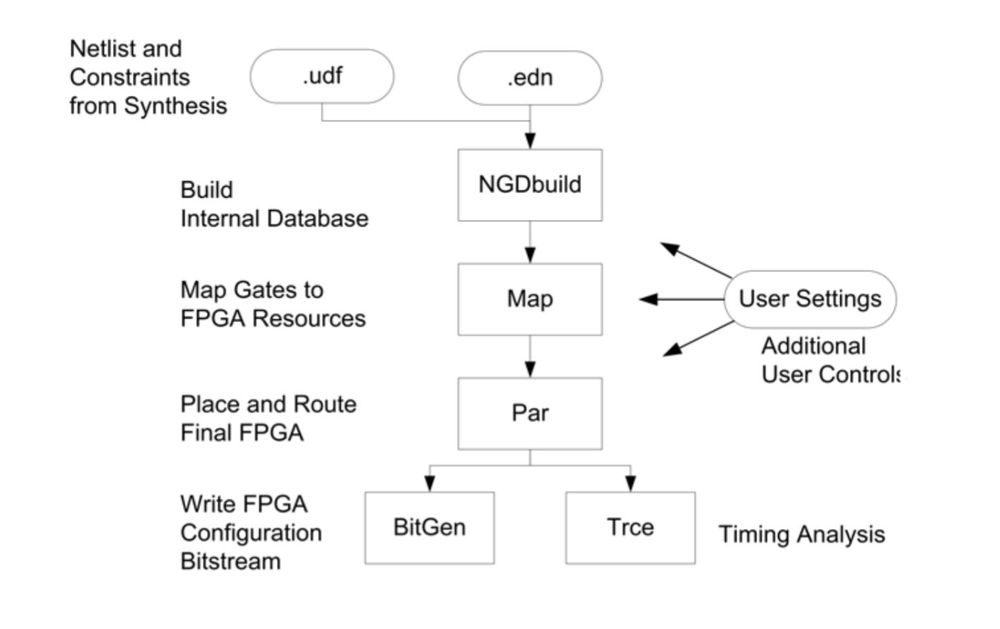
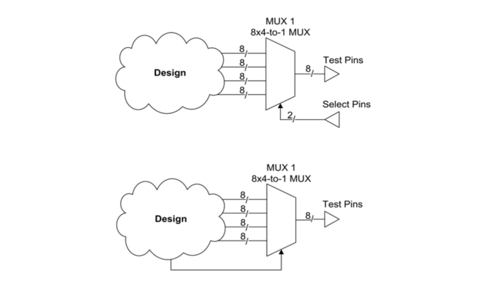
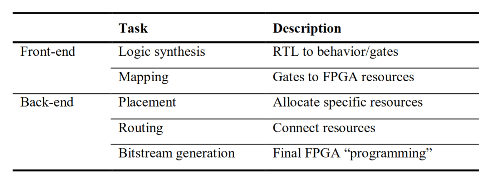
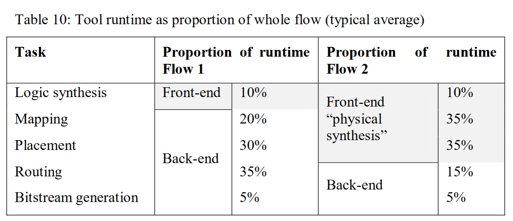

# 1. 原型验证流程概述

* Synthesis：可以在 partition 之前或之后进行。将 RTL 转换为 FPGA 网表。
* Design adaptation for FPGA：修改 Soc RTL 设计以适应FPGA 原型验证，例如：将 SoC 专用结构（例如时钟生成和其他 IP）替换为 FPGA 结构；以及调整内存等模块的大小，使其更适合 FPGA。
* Partitioning：将SoC RTL设计切分为多个可映射到各个FPGA的模块。如果设计无法容纳在单个FPGA中，则需要这一步骤。
* Constraint generation：这是在流程中输入各种实现约束（如时序和引脚分配）的一个方便环节。虽然这些约束可以在综合之后生成并应用到后端工具，但如果在综合步骤之前就添加约束，综合工具可以生成更加优化的FPGA网表，从而在布局布线后更好地满足面积/速度等约束条件。
* Place & route：将FPGA网表和用户约束转换为FPGA位流（bit stream）的过程，该位流将被加载到FPGA中，以实现设计功能。通常，这一过程被简单地称为“布局布线”，但实际上它包括多个步骤，例如映射、布局布线以及时序分析。

# 2. 原型验证流程

## 2.1 综合

与几乎所有 EDA 工具流程一样，核心是综合。对于基于 FPGA 的原型设计，综合将 SoC RTL 转换为多个 FPGA 网表，供后端工具使用，这些工具最终对 FPGA 进行布局和布线。然而，同时综合过程还期望从 RTL 中推断出常规结构，对其进行优化，并高效地映射到 FPGA 中，以满足空间和性能目标。

### 2.1.1 将 SoC 设计元素映射到 FPGA

将SoC设计映射到FPGA。许多FPGA资源对用户来说是透明支持的，因为综合工具会自动推断出FPGA结构来实现用户的RTL，几乎不需要或完全不需要用户干预。

#### 2.1.1.1 逻辑映射

由于逻辑资源是逻辑原型设计的主要资源，将RTL映射到CLB（配置逻辑块）是一个基本功能。例如，对于Xilinx® Virtex-6架构，综合工具应能够完成以下操作：

* 在需要多达六个输入的函数时，会自动推断使用LUT6。当需要更多或更少输入时，LUT会进行级联或拆分。例如，如果两个函数共享最多五个输入并且可以占用同一个CLB，工具会自动推断为双LUT5结构。
* 在SLICEM类型的slice中会自动推断为分布式RAM和高速移位寄存器的实现。
时钟使能信号（clock enable）也会被自动推断；对于低扇出（low-fanout）的时钟使能信号，还可以重新连线到LUT，以最大化slice的利用率。
* 工具会推断同步或异步的置位/复位（set/reset），并且能够防止或仲裁同时置位和复位的情况，以避免在硅片中出现不可预知的行为。例如，Synplify Pro可以检测到这种可能性，发出警告，并生成逻辑等价的单一异步复位逻辑。

#### 2.1.1.2 内存块映射

SoC 设计包含许多种类的内存单元，我们需要有效地映射这些内存单元以避免浪费 FPGA 资源。综合应该能够执行以下操作：

* 自动将单端口和双端口存储器结构推断为BlockRAM（块RAM）实现。
* 自动将流水线阶段中相邻的输入和输出寄存器打包到BlockRAM中。
* 利用BlockRAM的多种操作模式，包括先读（read-first）、先写（write-first）和无变化（no-change）模式：根据需要保留RAM输入端或输出端的初始值，以符合SoC的行为要求。
* 对于超出单个BlockRAM容量的大型存储器，能够自动将其拆分为多个BlockRAM，并添加必要的逻辑来分割和合并地址与数据。拆分的结构（如优化为速度或面积）也应当是可控的。

#### 2.1.1.3 DSP 块映射

许多 SoC 设计包含大量使用算术和算法功能的模块。如果工具可以默认将这些映射到 FPGA 中的 DSP 块，那么 FPGA 资源的大部分可以释放用于其他目的。

* 加法器/减法器：FPGA的逻辑单元具有简单的门电路结构或配置模式，可以更高效地实现进位功能，从而优化基本算术运算的实现。综合工具会自动利用这些结构。
* 乘法器：Synplify会自动推断在RTL中的乘法和累加功能及操作符使用DSP模块（参见上文3.3.1节的示例）。
* 预加器：在Xilinx® Virtex-6器件的DSP48中，综合工具应推断在乘法器前使用一个可选的25位加法器。
* DSP级联：对于RTL中更宽位数的算术运算，综合工具应在存在专用级联互连（如Xilinx® Virtex-6器件中的DSP48E块之间的端口）时，自动推断并使用多个DSP模块进行级联。
* 流水线支持：如果算术数据通路中有流水线寄存器，且适用，则这些寄存器会自动打包进DSP模块中。

### 2.1.2 综合与原型验证的关系

到目前为止，我们已经看到综合工具的任务是将 SoC 设计映射到可用的 FPGA 资源上。

原型验证有这样的三大定律：

* SoCs 比 FPGAs 更大
* SoCs 比 FPGAs 更快
* SoC 设计对 FPGA 不友好

实际上，面对这“三大定律”，综合工具对应的任务：

* 设计可能需要分区
* 设计可能无法在完整的 SoC 速度下运行
* 该设计可能需要一些修改才能使其适用于 FPGA

### 2.1.3 门控时钟映射

综合功能之一是能够自动操作设计以避免 RTL 变更，这是映射到 FPGA 资源之外的功能。这方面的最显著例子是在 SoC 设计中移除时钟门控，以简化映射到 FPGA。

综合除了将逻辑映射到FPGA资源之外的一个重要功能，是能够自动调整设计，从而避免直接更改RTL代码。其中最典型的例子就是去除SoC设计中的时钟门控，以简化向FPGA的映射。

时钟门控在SoC设计中很常见，但对于FPGA技术来说并不是最佳选择，因为FPGA内部有专用的低偏斜时钟分布网络，可以为芯片上的所有寄存器提供未门控的时钟。因此，Synopsys Synplify®工具会自动去除RTL设计中时钟网上的组合门控逻辑，并将门控逻辑应用到FPGA中大多数时序元件都具备的时钟使能引脚上。

经过时钟门控去除后的实现，其逻辑与原始输入逻辑等价，但资源利用更加高效，并且由于低偏斜的时钟分布，几乎可以消除建立时间和保持时间的违规问题。

下图是一些时钟门控转换的例子：

## 2.2 切分

SoC 设计通常比当今最大的 FPGA 设备要大，因此，圆形验证需要将 SoC 设计切分到多个较小的 FPGA 设备中。

划分主要有两种方法：综合前划分或综合后划分。我们将在下文中分别考虑这两种方法，以及一种不太常见的实际 SoC 网表划分方法。

### 2.2.1 综合前切分

在综合之前对设计进行切分。切分任务的过程是从整体设计树中创建适合FPGA规模的子设计，这一过程在一定程度上可以自动化。下图展示了综合前切分区工具流程的各个步骤。

综合前切分的方法可以让FPGA的综合可以在所有FPGA上并行执行。这要求切分阶段对每个FPGA的最终结果进行估算，从而推断每个器件的IO时序预算。

好处是通过并行运行多个综合工具，总体运行时间大大缩短，每次RTL更改和bug修复的响应时间也随之减少。

缺点是实际上它是一个两遍流程：先提前执行一次快速、自动的综合，估算资源和时序信息，获取结果后再反馈给切分工具，进行基于时序的切分。

自顶向下的综合前切分方法最强大的应用场景，是在对性能（尤其是FPGA间的性能）有较高要求时。通过自顶向下的方式结合系统级约束，综合前切分流程可以让时序预算和约束同时分配到多个FPGA上。此外，这种综合方式还能更好地考虑板级延迟和引脚复用，以便后续流程中能对单个FPGA做出更准确的时序约束。

### 2.2.2 综合后切分

综合后切分是在综合之后、在网表级别进行的。每个模块会被单独综合并映射到FPGA元件中，从而生成多个门级网表。这些网表会被合并成一个层次结构，然后重新分组为适合FPGA规模的分区。同时，网表也会根据FPGA的需求进行调整（例如，将门控时钟转换为时钟使能），并且会为那些需要外部建模的模块（如RAM）创建封装（wrapper）。

综合后切分的主要优点是，只需要对发生变动的RTL源文件重新综合，其他未变动的RTL文件的综合结果可以直接复用。最终的网表会合并，而分区的结果在模块边界未发生变化的情况下也可以复用。这使得整个流程更易于实现自动化和脚本化。

综合后切分的另一个优势在于其流程本身就是一个自然的“单遍”流程。也就是说，在分区阶段，设计已经被映射到了FPGA资源上，时序信息也足够准确，从而能够做出更精准的分区决策。因此，无需在综合前进行一次预运行来估算资源使用情况。

下表根据上面的讨论，对比了综合前切分和综合后切分两种流程。总体来说，综合前切分强调更快的响应速度和更高的自动化程度，而综合后切分则更有利于获得最优的实现结果。用户可根据实际需求在更快的迭代速度与实现效果最佳之间进行选择。

## 2.3 FPGA 后端（布局与布线）

无论采用预综合分区还是后综合分区，最终结果都是为每个FPGA生成一个已映射的网表（netlist），以及对应的时序、引脚位置等约束文件。在整个工具流程的末端，有一套由FPGA厂商提供的工具，这些工具可以被视为流程中的“后端”，用SoC术语来说即为“后端工具”。这些后端工具接收综合工具生成的网表和约束，将逻辑实现到目标FPGA中。

如下图，FPGA后端流程的简化流程图表明，第一步是将网表重新映射到最合适的FPGA资源上，尽可能进行优化。如果综合阶段的约束设置得当，且综合工具对目标FPGA器件有较强的适配能力，那么在后端阶段通常只需要很少的重新映射工作。

最后一步是生成比特流，该比特流将被编程到 FPGA 设备本身。在整个后期阶段，我们可以控制和分析各个步骤的结果，包括时序分析、布局规划，甚至估算最终功耗。

## 2.4 Debug 调试

调试工具会在FPGA设计中添加一些逻辑，用于在可编程事件发生时，将选定的信号捕获到未使用的存储块中。捕获后，这些信号可以通过JTAG工具从FPGA中读出，并以多种方式显示，比如波形图或直接在源代码中显示信号值。

### 2.4.1 实时信号探测（添加测试点）

实时观察节点是一种常见的调试方法，因为除了信号状态之外，实时探测还可以发现竞争条件和意外的“毛刺”信号。在实时探测（real-time probing）中，会将设计中的信号引出到实验室仪器，比如逻辑分析仪或示波器，用于设计分析。被探测的信号要么本来就可用在FPGA的边界引脚上，要么需要专门从设计的内部节点引出到FPGA的测试引脚上。

在最简单的内部节点探测方法中，用户直接修改设计，将内部节点引出到FPGA的引脚上以实现实时探测。这种方法几乎不消耗逻辑资源，只需要少量布线资源，以及实际用于引出信号的IO引脚。当然，为了在设计中增加测试点，通常需要修改RTL代码，因此这种方式对许多项目来说未必可行。不过，现在有些调试工具支持在不更改代码的情况下自动推断测试点。比如 Synopsys FPGA 综合工具支持一个名为 syn_probe 的属性，它将执行上述功能。

Copilot said: 如果确实需要（且允许）对RTL进行修改，那么我们至少应该尽量减少修改的影响范围和规模。好在，两大主流HDL语言都支持在设计层次结构的不同部分之间进行远程链接。在VHDL中可以通过全局信号实现，在Verilog-HDL中则通过XMR（跨模块引用）来实现。关于远程引用的更多信息和示例将在第7章详细介绍。 为了将测试点引出而进行RTL修改的一个缺点是：每次想查看不同的信号或信号组时，响应周期会很长。要查看新的信号，必须修改FPGA设计的RTL源代码，然后再次经过综合和布局布线流程。这一过程可能相当耗时。为了缓解这个问题，建议提前考虑一组可能需要探测的信号，并尽量多地将这些信号引出到可见点。不过，在大多数基于FPGA的原型设计项目中，FPGA的IO引脚资源非常宝贵，可作为测试点的备用IO数量往往有限。 一种简单且低成本的提升内部信号可见性的方法，是在设计顶层创建一个“test header”端口，可以方便地将各种信号连接到这里，便于后续调整。如果想进一步减少设计反复，或者信号观测用的引脚数量有限，可以采用更为灵活的方案，用多路复用的方式将多路信号通过少量引脚引出，原理示意如下图所示：
如果确实需要（且允许）对RTL进行修改，那么我们至少应该尽量减少修改的影响范围和规模。好在，两大主流HDL语言都支持在设计层次结构的不同部分之间进行远程链接。在VHDL中可以通过全局信号实现，在Verilog-HDL中则通过XMR（跨模块引用）来实现。关于远程引用的更多信息和示例将在第7章详细介绍。

为了将测试点引出而进行RTL修改的一个缺点是：每次想查看不同的信号或信号组时，响应周期会很长。要查看新的信号，必须修改FPGA设计的RTL源代码，然后再次经过综合和布局布线流程。这一过程可能相当耗时。为了缓解这个问题，建议提前考虑一组可能需要探测的信号，并尽量多地将这些信号引出到可见点。不过，在大多数基于FPGA的原型设计项目中，FPGA的IO引脚资源非常宝贵，可作为测试点的备用IO数量往往有限。

一种简单且低成本的提升内部信号可见性的方法，是在设计顶层创建一个“test header”端口，可以方便地将各种信号连接到这里，便于后续调整。如果想进一步减少设计反复，或者信号观测用的引脚数量有限，可以采用更为灵活的方案，用多路复用的方式将多路信号通过少量引脚引出，原理示意如下图所示：

如上图，设计中加入了一个8位宽的4选1多路复用器（MUX1），其选择信号由FPGA外部的两位选择位静态控制。通过这种多路复用器，可以在32个信号中选择任意8个信号进行观测。

文中还提到第二个8位宽的4选1多路复用器（MUX2），不过它的选择信号由内部处理器或状态机控制。这种方式节省了两个外部选择引脚，并且在某些场景下简化了多路复用器的控制逻辑。

如果可能的话，建议使用XMR（跨模块引用）或全局信号，将下层模块的信号连接到多路复用器的输入端，以便进行观测。（关于XMR的具体用法将在第7章详细介绍。）

### 2.4.2 非实时信号探测

Virtex FPGA 最常用的 FPGA 探针工具是 Xilinx 的 ChipScope 系列工具（网表级别信号追踪）和 Synopsys 的 Identifytools（RTL 级别信号跟踪）

# 3. FPGA 评估

## 3.1 FPGA 资源评估

在评估一个SoC设计中FPGA资源使用情况时，需要估算的资源包括：FPGA IO、随机逻辑、触发器（FFs）、存储块、算术单元以及时钟。对于存储块、乘法器和高速IO等特殊资源，人工估算相对简单且较为准确，但对于随机逻辑和触发器的估算则更为困难，误差也更大。因此，建议首先基于这些特殊资源判断设计是否能够放入FPGA中，并且一旦设计能够综合，就应尽快通过综合工具进行一次资源使用的准确评估。如果设计已经可综合，建议先使用一次快速综合评估，以便了解大致的资源利用率。

在获得了某个设计的FPGA资源利用率之后，还需要结合设计的成熟度确定合适的利用率目标。一般来说，FPGA资源利用率越高，设计处理（综合、布局布线等）所需时间越长，系统时钟频率也会因布线延迟增加而降低。此外，在原型验证项目中，设计通常会发生变更，后续可能还需要增加调试逻辑，因此应保守地规划系统中的FPGA数量。

另一方面，如果设计被分配到过多的FPGA上，则会增加成本和实现复杂度。虽然不同设计的规模和性能差异较大，但通常建议，初始的FPGA利用率应低于50%；对于预计会扩展的部分设计，建议利用率更低。总的来说，建议在资源估算时适当保守，宁可高估资源需求而多买一些FPGA，也不要低估资源导致项目延误，因为项目延期的代价往往比多买几片FPGA更高。

此外，还需要考虑合理使用多少FPGA资源。FPGA器件是否可以被完全填满，还是应该为后期设计更改或增加调试逻辑预留一定余量？要记住，FPGA原型验证的一个重要目标是降低整个SoC项目的风险，因此将所有的逻辑都挤进FPGA并不是最低风险的做法。除了没有扩展余地之外，FPGA的布局布线效果也会变差，运行时间也会大幅增加。当器件资源使用过满时，这些问题会更加突出。一般建议FPGA的资源利用率不要超过75%，这是量产FPGA设计的常见标准；对于原型验证项目，控制在60%甚至50%以内也是合理的。这样可以缩短设计迭代的周期，也更容易达到目标性能。

## 3.2 FPGA 性能评估

性能估计与资源利用率和 FPGA 性能参数紧密相关。从综合工具中可以轻易地获得整个设计的相当不错的性能估算。尽管综合工具考虑了布线延迟，但实际时序取决于 FPGA 布局布线过程，并且可能与综合工具的估算有所不同。虽然随着利用率的提高，差异可能变得显著，因为布线可能变得更加困难，但初始时序估算是非常有用的指导。

FPGA 性能很大程度上取决于提供给综合工具的约束。这些约束指导综合工具，进而指导布局布线工具如何最好地实现所需的性能。

影响多FPGA系统设计时钟频率的主要因素包括：

* 设计类型：高度流水线、适合FPGA架构并充分利用触发器的设计通常能跑得更快。
* 内部连线复杂度：高扇出、复杂互连的设计因布线延迟更长，时钟频率较低，且分区难度大，常需要IO复用。
资源利用率：利用率越高，设计越拥挤，内部延迟越大，时钟频率越低。
* FPGA本身性能：即使设计和工具流程都最优，最终仍受FPGA硬件极限制约。但大多数情况下，设计和工具效率才是主导因素。
* FPGA间时序：多FPGA系统中，FPGA间的时钟偏移和连线延迟会限制整体时钟速度，标准IO速度远低于FPGA内部逻辑速度，往往成限制瓶颈。
* 外部接口：原型系统通常比SoC目标频率低，如果系统是闭环或外部激励可降速，无大影响；但若需配合无法降速的外部信号，则会受限。
* FPGA间连线：当FPGA间IO用尽时，可用引脚复用（时分复用），多路信号共享一个引脚，需更高的时钟频率支撑，但实际单路信号速率反而降低。

## 3.3 FPGA流程处理时间评估

一般来说，FPGA资源利用率越高，可实现的时钟频率就越低，FPGA的处理时间也会越长。如前文所述，FPGA实现流程包含前端和后端两个阶段，主要包括五个任务：逻辑综合、逻辑映射、模块布局、互联布线，以及最终的FPGA比特流生成。这些任务在下表中进行了总结。

如上所示，布局和布线通常比综合花费更长的时间，并且随着设计规模增大和时序约束更加严格，这一点会更加明显。